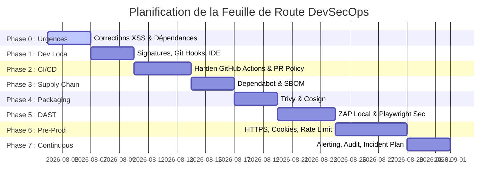

# 🗺️ Feuille de Route DevSecOps — CyberScope LAB

Cette feuille de route présente une démarche progressive en **8 phases** pour sécuriser le développement, la CI/CD et l'environnement de production du projet **CyberScope LAB**.

---

## 📅 Synthèse Globale des Phases

---

## Phase 0 — Corrections Critiques Immédiates

*   **Objectif** : Éliminer les vulnérabilités actives directement exploitables (DOM XSS) et les failles de dépendances de production.
*   **Contrôles** :
    *   **[x] US-01 — Résolution du DOM XSS sur le rendu des articles** : Clôturée avec succès. Les variables dynamiques provenant de l'URL et de Strapi sont encodées et injectées via `textContent`. (Commit: `5d3c47f0875bc0452a4e86b57c56c54b7151a773`).
    *   **[/] US-02 — Correction progressive des dépendances backend et outils** : En cours d'audit technique. Évaluation de l'exploitabilité réelle, de la stratégie par lots et des risques de régression.
        *   *Validation de signature* : Vérification systématique des signatures via `npm audit signatures` (1422 packages signés, 140 attestations vérifiées).
        *   *Découpage du Lot A (Overrides Backend)* :
            *   **[x] A1** : Override de `undici` vers `^6.28.0` (client HTTP actif au runtime - validé et implémenté).
            *   **[x] A2** : Override de `sharp` vers `^0.35.3` (traitement d'images d'administration - validé et implémenté).
            *   **[ ] A3** : Override de `tar` vers `^7.5.3` (migrations CLI / backups).
            *   **[ ] A4** : Override de `nodemailer` vers `^6.9.15` (mailer par défaut inactif).
            *   **[ ] A5** : Override de `ws` vers `^8.18.0` (WebSockets en environnement local).
*   **Fichiers créés/modifiés** :
    *   [assets/JS/article.js](file:///c:/Users/user/Desktop/developpeur/BLOG%20PERSO/cyberscop%20LAB/assets/JS/article.js) (Sécurisation et filtre d'encodage local).
    *   [docs/devsecops/DEVSECOPS_AUDIT.md](file:///c:/Users/user/Desktop/developpeur/BLOG%20PERSO/cyberscop%20LAB/docs/devsecops/DEVSECOPS_AUDIT.md) (Rapport d'audit de sécurité des dépendances).
*   **Outils de validation** : `npm test`, `npx playwright test`, `npm audit`, `npm audit signatures`.
*   **Tests** :
    *   Vérification unitaire Jest des divers payloads d'attaque XSS (script, onerror, SVG onload, javascript:).
    *   Validation E2E Playwright de la non-exécution dans le navigateur.
    *   Validation après chaque sous-lot (A1 à A5) par l'exécution de `npm test` et `npx playwright test` pour mesurer précisément le nombre de vulnérabilités résolues sans régression.
*   **Critères d'acceptation** : Aucun script arbitraire ne s'exécute. Le serveur Strapi et le provider Brevo patché fonctionnent sans régression. `npm audit` exempt de failles de sévérité élevée.
*   **Estimation d'effort** : 3 jours (XSS résolu en 1 jour, Audit dépendances et plan progressif rédigé en 2 jours).
*   **Validation humaine requise** : **Oui** (validation requise pour appliquer le premier sous-lot A1).

---

## Phase 1 — Socle Local Développeur

*   **Objectif** : Sécuriser la machine du développeur, assurer l'authenticité des commits et bloquer les fuites de secrets en amont.
*   **Prerequisites** : Phase 0 validée.
*   **Contrôles** :
    *   Signature obligatoire de tous les commits Git.
    *   Scan de secrets systématique en pré-commit.
    *   Validation statique locale (ESLint et Semgrep IDE).
*   **Fichiers à créer/modifier** :
    *   Création d'un guide développeur `docs/devsecops/DEVELOPER_GUIDE.md`.
*   **Outils** : GPG/SSH keys, pre-commit framework, Gitleaks, ESLint, Semgrep local.
*   **Commandes** :
    *   `gpg --gen-key` ou `ssh-keygen -t ed25519 -sk`
    *   `git config --global commit.gpgsign true`
    *   `pre-commit install`
*   **Tests** :
    *   Tentative de commit avec un faux secret (ex: `xkeysib-123456789...`) pour valider le blocage Gitleaks.
*   **Preuves attendues** : Badge "Verified" sur GitHub. Échec du commit contenant la fausse clé API avec message d'erreur Gitleaks.
*   **Critères d'acceptation** : 100% des futurs commits signés. Hook pré-commit actif.
*   **Risques de régression** : Ralentissement mineur lors du commit (environ 1-2s pour le scan Gitleaks).
*   **Documentation** : Guide développeur pour la configuration des clés GPG/SSH et installation de pre-commit.
*   **Estimation d'effort** : 1.5 jour.
*   **Validation humaine requise** : **Non** (configuration propre à la machine du développeur).

---

## Phase 2 — Intégration Continue (CI) Minimale Obligatoire

*   **Objectif** : Durcir les règles de validation lors des Pull Requests et s'assurer que la CI bloque en cas de failles ou dérives de politiques.
*   **Prerequisites** : Phase 1 validée.
*   **Contrôles** :
    *   Activer les contrôles bloquants (exit-code 1) sur Semgrep et CodeQL dans la CI.
    *   Configurer la protection de la branche `main` et `dev`.
*   **Fichiers à créer/modifier** :
    *   Configuration GitHub de protection de branches (via l'UI GitHub).
    *   [semgrep.yml](file:///c:/Users/user/Desktop/developpeur/BLOG%20PERSO/cyberscop%20LAB/.github/workflows/semgrep.yml) et [codeql.yml](file:///c:/Users/user/Desktop/developpeur/BLOG%20PERSO/cyberscop%20LAB/.github/workflows/codeql.yml) (vérifier que les échecs provoquent l'arrêt du build).
*   **Outils** : GitHub Actions, GitHub Branch Protection.
*   **Commandes** : Configuration via l'interface d'administration GitHub.
*   **Tests** : Ouvrir une Pull Request contenant une vulnérabilité triviale (ex: `eval("input")`) et s'assurer que la PR ne peut pas être fusionnée sans correction.
*   **Preuves attendues** : Statut rouge sur les vérifications GitHub. Bouton "Merge" grisé.
*   **Critères d'acceptation** : Push direct interdit sur `main` et `dev`. Une revue approuvée et les tests de sécurité au vert sont obligatoires pour fusionner.
*   **Risques de régression** : Blocage temporaire des livraisons en cas de faux positifs de la CI.
*   **Documentation** : Procédure de traitement des alertes de CI.
*   **Estimation d'effort** : 2 jours.
*   **Validation humaine requise** : **Oui** (nécessite des droits d'administration sur le dépôt GitHub).

---

## Phase 3 — Gouvernance des Dépendances et Supply Chain

*   **Objectif** : Automatiser la surveillance des dépendances et licences, et publier des SBOMs (Software Bill of Materials).
*   **Prerequisites** : CI active.
*   **Contrôles** :
    *   Détection automatique des dépendances obsolètes ou vulnérables.
    *   Génération de SBOM CycloneDX stocké en tant qu'artefact de build.
*   **Fichiers à créer/modifier** :
    *   [.github/dependabot.yml](file:///c:/Users/user/Desktop/developpeur/BLOG%20PERSO/cyberscop%20LAB/.github/dependabot.yml) [NEW]
*   **Outils** : Dependabot, Trivy (déjà configuré dans la CI).
*   **Commandes** : Création du fichier de configuration Dependabot.
*   **Tests** : Déclencher manuellement un scan Dependabot sur le dépôt GitHub.
*   **Preuves attendues** : Alertes Dependabot visibles dans l'onglet Security de GitHub. Artefact `cyberscop-lab-sbom.json` généré dans les runs de CI.
*   **Critères d'acceptation** : SBOM conforme généré à chaque commit sur `main`. Dependabot configuré pour envoyer des PR de mise à jour de sécurité hebdomadaires.
*   **Risques de régression** : Trop grand nombre de PR générées par Dependabot (bruit).
*   **Documentation** : Processus de revue des dépendances.
*   **Estimation d'effort** : 1 jour.
*   **Validation humaine requise** : **Non** (automatisation standard GitHub).

---

## Phase 4 — Packaging Sécurisé (Supply Chain Avancée)

*   **Objectif** : Durcir la construction des conteneurs d'exécution et garantir l'authenticité de l'artefact livré.
*   **Prerequisites** : Phase 3 validée.
*   **Contrôles** :
    *   Exécution des conteneurs Nginx et Strapi sans privilèges Root (USER configuré).
    *   Scan de l'image de conteneur finale.
    *   Signature des conteneurs via Cosign.
*   **Fichiers à créer/modifier** :
    *   Mise à jour de [.github/workflows/trivy.yml](file:///c:/Users/user/Desktop/developpeur/BLOG%20PERSO/cyberscop%20LAB/.github/workflows/trivy.yml) pour scanner les images Docker générées.
*   **Outils** : Docker, Trivy, Cosign, Sigstore.
*   **Commandes** :
    *   `cosign sign --key cosign.key $IMAGE_URL` (dans la CI).
*   **Tests** :
    *   Vérifier localement et dans la CI que l'image démarre en tant qu'utilisateur non-root.
*   **Preuves attendues** : Rapport de scan Trivy d'image sans vulnérabilité critique. Signature Cosign valide vérifiable sur le registre de conteneurs.
*   **Critères d'acceptation** : Dockerfile frontend et backend conformes aux règles OPA de `conftest`. Image signée avant d'être poussée sur le registre.
*   **Risques de régression** : Problèmes de droits de lecture/écriture de fichiers dans le conteneur suite au passage à l'utilisateur non-root.
*   **Documentation** : Procédure de gestion des clés Cosign.
*   **Estimation d'effort** : 3 jours.
*   **Validation humaine requise** : **Oui** (requiert la mise en place d'un registre d'images comme GitHub Packages ou Docker Hub).

---

## Phase 5 — Tests Sécuritaires Dynamiques (DAST)

*   **Objectif** : Tester la sécurité de l'application en cours d'exécution dans un environnement isolé (localhost ou staging).
*   **Prerequisites** : Application conteneurisée fonctionnelle.
*   **Contrôles** :
    *   Fuzzing et scan de vulnérabilités dynamiques sur l'API et le frontend.
    *   Tests d'authentification et de non-régression de sécurité.
*   **Fichiers à créer/modifier** :
    *   Configuration d'un workflow de test DAST [.github/workflows/dast.yml](file:///c:/Users/user/Desktop/developpeur/BLOG%20PERSO/cyberscop%20LAB/.github/workflows/dast.yml) [NEW].
*   **Outils** : OWASP ZAP (ZAP Baseline Scan), Playwright (pour l'injection automatique de payloads).
*   **Commandes** :
    *   `docker run -v $(pwd):/zap/wrk/:rw -t ghcr.io/zaproxy/zaproxy:stable zap-baseline.py -t http://localhost:8080 -r zap_report.html`
*   **Tests** : Exécuter la suite de tests Playwright conjointe au scan ZAP.
*   **Preuves attendues** : Fichier `zap_report.html` généré et exempt d'alertes de niveau Critique/Haut.
*   **Critères d'acceptation** : Aucun faux positif persistant. Le scan s'exécute uniquement sur un environnement temporaire isolé.
*   **Risques de régression** : Le scan DAST agressif peut saturer la base de données SQLite locale ou envoyer des e-mails en boucle (Brevo). Le serveur doit être configuré en mode mock ou isolé de Brevo durant le scan.
*   **Documentation** : Guide d'utilisation et d'analyse des rapports DAST.
*   **Estimation d'effort** : 4 jours.
*   **Validation humaine requise** : **Oui** (arbitrage sur les outils DAST et configuration de l'infrastructure de test).

---

## Phase 6 — Préproduction et Durcissement d'Architecture

*   **Objectif** : Durcir la configuration système et réseau avant l'accès public des utilisateurs finaux.
*   **Prerequisites** : Phase 5 validée.
*   **Contrôles** :
    *   Mise en place de HTTPS (TLS 1.3).
    *   Chiffrement de la base de données au repos (ou isolation forte).
    *   Refactoring de la gestion de session (migration du LocalStorage vers des Cookies HttpOnly sécurisés).
    *   Rate limiting global sur l'ensemble de l'API en production.
*   **Fichiers à créer/modifier** :
    *   Fichiers de configuration Nginx de production (nginx.conf).
    *   Code source de gestion des sessions ([assets/JS/mon-espace.js](file:///c:/Users/user/Desktop/developpeur/BLOG%20PERSO/cyberscop%20LAB/assets/JS/mon-espace.js) et controleurs Strapi).
*   **Outils** : Certificats Let's Encrypt / Certbot, Koa/Strapi Middleware.
*   **Commandes** : Déploiement système sur serveur.
*   **Tests** : Validation de la présence des attributs `HttpOnly`, `Secure` et `SameSite=Strict` sur le cookie de session via la console développeur. Scan SSL Labs de l'URL publique.
*   **Preuves attendues** : Cookies invisibles dans `document.cookie`. Note SSL Labs supérieure ou égale à A.
*   **Critères d'acceptation** : Toutes les requêtes HTTP sont redirigées vers HTTPS. Les jetons de session ne transitent jamais en clair.
*   **Risques de régression** : Risque élevé de dysfonctionnement de la connexion si les cookies de domaine ne sont pas correctement partagés entre le frontend statique (GitHub Pages) et le serveur API backend.
*   **Documentation** : Spécification technique d'architecture de production.
*   **Estimation d'effort** : 5 jours.
*   **Validation humaine requise** : **Oui** (nécessite l'acquisition d'un nom de domaine et d'un serveur d'hébergement pour le backend).

---

## Phase 7 — Production, Surveillance et Amélioration Continue

*   **Objectif** : Assurer le maintien en condition de sécurité (MCO), la détection des incidents et la gouvernance à long terme.
*   **Prerequisites** : Application en production.
*   **Contrôles** :
    *   Supervision applicative et système en temps réel.
    *   Alerting de sécurité en cas de pic de requêtes 4xx/5xx ou d'accès d'administration.
    *   Rotation régulière des secrets (Brevo, clés Strapi).
*   **Fichiers à créer/modifier** :
    *   `docs/devsecops/INCIDENT_RESPONSE_PLAN.md` [NEW].
    *   `docs/devsecops/SECRET_ROTATION_PROCEDURE.md` [NEW].
*   **Outils** : Prometheus, Grafana, Loki (ou équivalents cloud légers), Uptime Kuma.
*   **Commandes** : Déploiement et configuration des agents de logs et monitoring.
*   **Tests** : Simulation de panne ou d'accès d'administration pour valider le déclenchement de l'alerte.
*   **Preuves attendues** : Notifications d'alertes reçues sur le canal dédié (ex: Discord/Slack/Email).
*   **Critères d'acceptation** : Uptime mesuré et alerté. Procédures de secours testées et validées semestriellement.
*   **Risques de régression** : Surcharge CPU liée au traitement agressif des logs.
*   **Documentation** : Plan de réponse aux incidents, registre des risques.
*   **Estimation d'effort** : 3 jours.
*   **Validation humaine requise** : **Oui** (choix de l'outillage de monitoring et d'alerting par le client).
